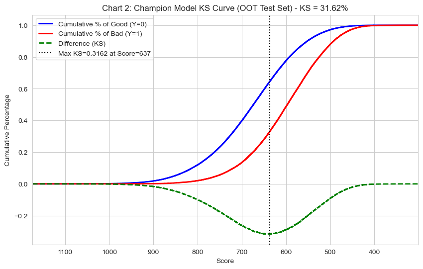
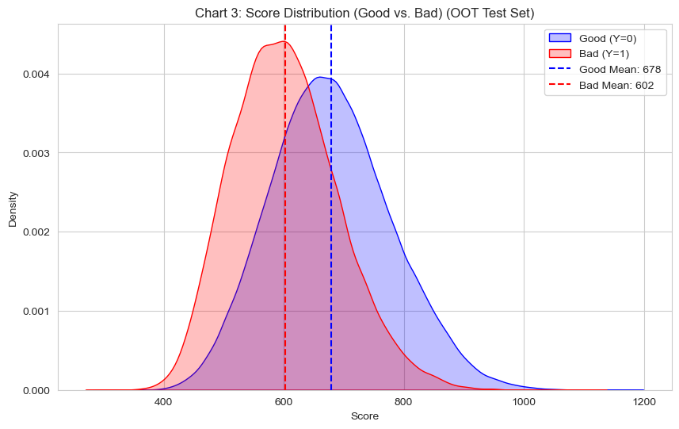

# A卡风控模型 (A-Scorecard) 选型与评估报告

| | |
| :--- | :--- |
| **项目名称** | Lending Club A卡（申请评分卡）模型开发 |
| **报告日期** | 2025年10月20日 |
| **报告目的** | 对比 XGBoost, LightGBM, CatBoost 三种模型，确定“冠军模型”(Champion) 并评估其部署可行性。 |
| **核心结论** | **CatBoost** 在 OOT（Out-of-Time）测试集上表现最佳，以 **AUC 0.7160, KS 0.3162** 的性能微弱优势胜出。所有三个模型均表现出**极高的稳定性** (PSI < 0.01)。**建议采纳 CatBoost 作为冠军模型上线部署。** |

---

### 1. 执行摘要 (Executive Summary)

为构建新一代A卡风控模型，本项目团队基于 Lending Club (2007-2014) 数据，采用严格的 OOT（时间外）滚动窗口验证法，对 XGBoost、LightGBM 和 CatBoost 三种主流GBDT算法进行了全面评估。

**核心发现：**
1.  **性能对比 (Performance):** 所有模型均表现良好 (OOT AUC > 0.70)。**CatBoost** (AUC 0.7160) 和 **LightGBM** (AUC 0.7143) 处于第一梯队，性能显著优于 XGBoost (AUC 0.7039)。
2.  **稳定性 (Stability):** 所有模型均表现出**极高的稳定性**（模型分PSI均 < 0.01）。这得益于严格的滚动窗口训练和核心稳定特征筛选策略，证明三个模型均具备抗客群漂移的健壮性。
3.  **业务可用性 (Usability):** 结合“两点锚定法”的评分卡（以CatBoost为例）能有效分离好、坏客户，**平均分差达76.2分**，分数分布直观，易于业务方理解和部署策略。

**最终建议：**
* **冠军模型 (Champion):** 选用 **CatBoost**。它在性能、稳定性、类别特征处理上达到了最佳平衡。
* **挑战者模型 (Challenger):** 选用 **LightGBM**。其性能与CatBoost极为接近，且模型分PSI最低 (0.0034)，可作为A/B测试或冠军模型的首选B角。

---

### 2. 模型开发方法论

为确保模型在真实业务环境中的有效性和稳定性，本项目遵循了以下工业级风控建模标准：

1.  **验证策略 (Validation):** 采用严格的**滚动时间外（OOT）**验证，杜绝数据穿越。
    * **训练集 (Train):** 2012-01-01 -> 2013-06-30
    * **验证集 (Validation):** 2013-07-01 -> 2013-12-31 (用于Optuna调参与早停)
    * **测试集 (Test-OOT):** 2014-01-01 -> 2014-12-31 (本报告所有指标均源于此)
2.  **特征策略 (Features):** 筛选了15-20个最核心、最稳定的申请及信用特征（如`fico_range_high`, `dti`, `int_rate`等），并构建了稳健的比率型衍生特征。
3.  **模型约束 (Constraints):** 所有模型均应用了**单调性约束**，确保模型行为（如“FICO分越高，风险越低”）符合风控常识，增强了模型的可解释性。
4.  **评分卡转换 (Scoring):** 采用**“两点锚定法”**（例如：5%违约率=800分, 20%违约率=600分）将模型概率转换为业务评分，确保分数范围可控且直观。

---

### 3. 三大模型横向对比 (OOT Test Set)

#### 3.1. 核心指标量化对比

下表汇总了三个模型在**2014年OOT测试集**上的关键表现：

| 评估指标 | XGBoost | LightGBM | **CatBoost (冠军)** | 工业界标准 |
| :--- | :--- | :--- | :--- | :--- |
| **区分度 (AUC)** | 0.7039 | 0.7143 | **0.7160** | > 0.70 (良好) |
| **区分度 (KS)** | 0.2964 | 0.3129 | **0.3162** | > 0.25 (良好) |
| **模型分 PSI** | 0.0067 | 0.0034 | 0.0066 | < 0.10 (优秀) |
| **最高特征 PSI** | 0.0605 | 0.0604 | 0.0604 | < 0.10 (优秀) |
| **模型复杂度** | 434 (迭代) | 951 (迭代) | 486 (迭代) | (参考) |

#### 3.2. 性能与区分度分析

* **结论：** CatBoost 和 LightGBM 在风险排序能力上显著优于 XGBoost。
* **分析：** 如图表1（CatBoost ROC曲线）所示，冠军模型的AUC达到了 **0.7160**，表现出强大的排序能力。LightGBM (0.7143) 紧随其后，两者性能在业务上几无差别。XGBoost (0.7039) 虽已达标，但与前两者存在差距。
* KS 统计量印证了这一点。**CatBoost (31.62%)** 和 LightGBM (31.29%) 均能非常有效地在好、坏客群间“切一刀”，其KS值均高于30%，表现强劲。

#### 3.3. 稳定性分析 (PSI)

* **结论：** 所有三个模型均**极其稳定**，抗风险能力极强。
* **分析：** 稳定性是风控模型的生命线。三个模型的模型分PSI均在 **0.01 以下**（LightGBM 甚至低至 0.0034），这在行业内是**典范级**的稳定表现。
* 如图表4（CatBoost 稳定性分布）所示，训练集（蓝色）和OOT测试集（橙色）的分数分布曲线**几乎完全重合**。这直观地证明了模型学到的风险模式在一年后依然有效，客群未发生显著漂移。这归功于稳健的特征策略和OOT训练方法。

---

### 4. 冠军模型 (CatBoost) 深度分析

#### 4.1. 风险区分度 (AUC & KS)

* **图表 1 (ROC 曲线, `clipboard3.png`)**: OOT AUC 达到 0.7160，曲线形态饱满，模型在所有阈值上均表现稳健。

* **图表 2 (KS 曲线, `clipboard10.png`)**:
    * 模型 KS 值达到 **31.62%**，区分能力强。
    * **最大KS点**出现在分数为 **637** 的位置。这意味着在 637 分时，模型对好、坏客户的累积区分能力达到顶峰。
    * **策略意义：** 637 分是设置核心审批拒绝线 (Cut-off) 的**首要参考点**。低于此分数的客群，坏人累积速度远快于好人。

#### 4.2. 业务可用性 (分数分布)

* **图表 3 (好坏客户分数分布, `clipboard8.png`)**:
    * 该图是模型业务价值的最直观体现。采用“两点锚定法”后，分数分布完全符合业务直觉。
    * **好客户 (Y=0, 蓝色)** 均值为 **678 分**。
    * **坏客户 (Y=1, 红色)** 均值为 **602 分**。
    * 两个分布的主体被清晰拉开，**76.2 分的平均分差**提供了巨大的策略操作空间（如分层定价、设置观察名单等）。

#### 4.3. 稳定性 (PSI)

* **图表 4 (模型分数稳定性, `clipboard9.png`)**:
    * 该图直观展示了 `PSI = 0.0066` 的含义：训练集（蓝色）和OOT测试集（橙色）的分布曲线高度重合。
    * **结论：** 模型极其健壮，可以安全部署上线，且在未来较长时间内（如6-12个月，视业务变化）无需担心模型因客群漂移而失效。

---

### 5. 结论与部署建议

1.  **冠军模型 (Champion):**
    * **CatBoost**。理由：在OOT上具有最高的区分度 (AUC/KS)，且保持了顶级的稳定性 (PSI)。其对类别特征的优化处理也使其在特征工程上更具优势。

2.  **挑战者模型 (Challenger):**
    * **LightGBM**。理由：性能与CatBoost在伯仲之间 (AUC 0.7143)，且拥有最低的模型分PSI (0.0034)。它可作为冠军模型的A/B Test挑战者或首选备用方案。

3.  **评分卡策略：**
    * 采用在CatBoost上验证通过的**“两点锚定法”**（Offset ≈ 422, Factor ≈ 128）作为全行统一的评分标准。

4.  **上线策略与监控：**
    * **初始 Cut-off 建议：** 可参考最大KS点 (637分) 及图3的分数分布，与业务方共同商定初始拒绝线（例如 620-640 分之间）。
    * **上线监控：** 必须建立常态化的模型监控机制，**按月**监控模型的 OOT AUC, KS, 以及模型分和核心特征的 PSI，确保模型表现符合预期。