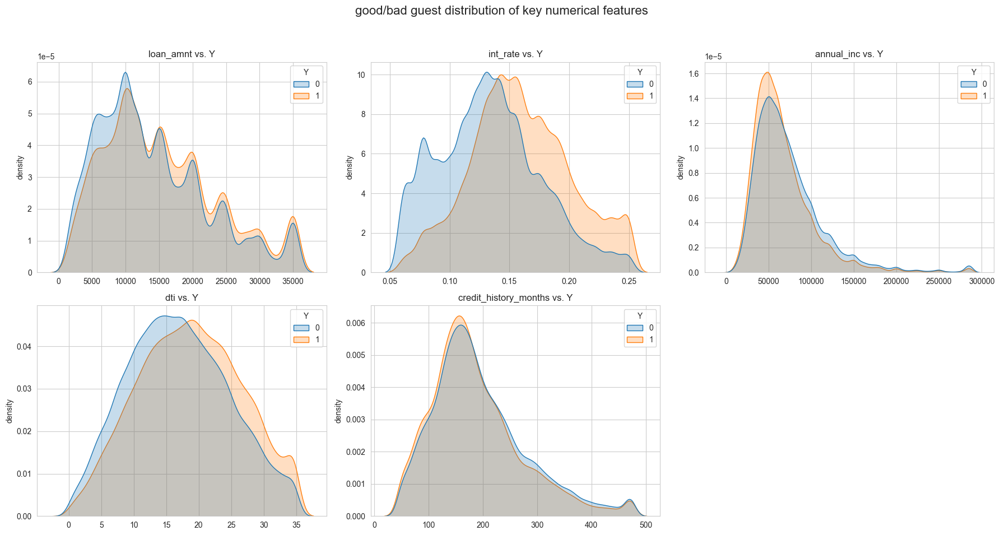
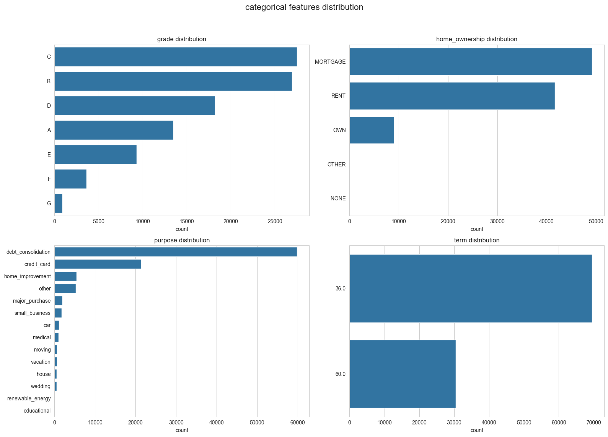
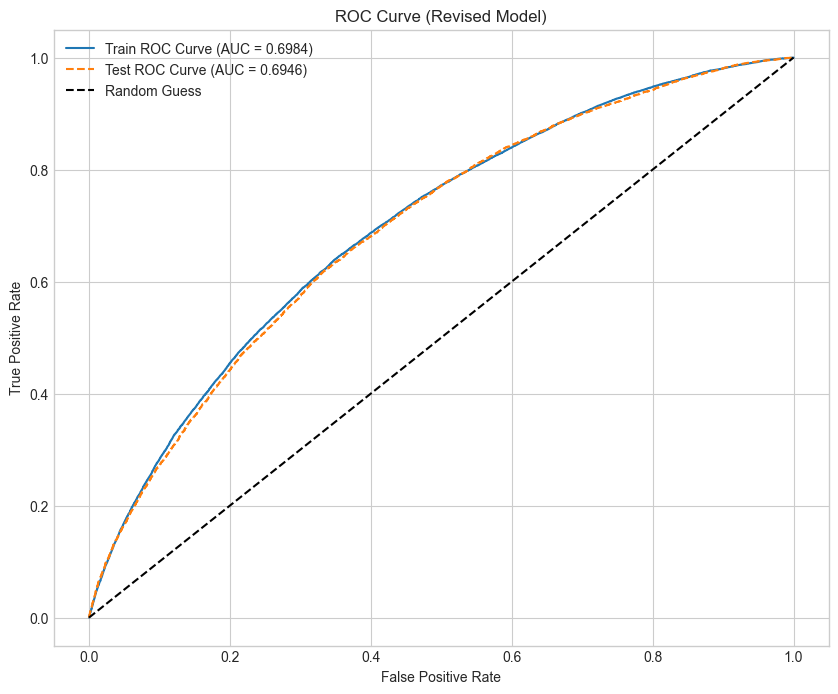

# 个人消费贷申请评分卡（A卡）模型报告 

## 1. 报告摘要 (Executive Summary)

**项目目标**: 本报告旨在记录利用LendingClub历史贷款数据，开发一个用于个人消费贷申请环节的信用风险评分模型（A卡）的全过程，以量化评估新客户的违约风险。

**核心成果**:
本项目成功构建了一个包含10个关键预测变量的、稳健且可解释的评分卡模型。模型在独立的测试集上通过了区分能力、排序能力和稳定性的多维度检验。

- **模型区分能力**:
    - **测试集 AUC**: **0.6946**
    - **测试集 KS**: **0.2856**
- **模型稳定性**:
    - 训练集与测试集性能差异极小，无过拟合。
    - 最终分数**PSI为0.0008**，表明模型在不同客群上表现高度稳定。
- **模型解释性**:
    - 所有入模变量的评分逻辑均符合风控业务常识，生成的评分卡规则清晰、直观。

**最终结论**:
该模型性能稳健、验证全面，达到了可部署于实际信贷审批业务的工业标准。建议采纳此模型，并基于其评分制定相应的信贷策略。

---

## 2. 探索性数据分析 (EDA)

在建模之前，我们对关键变量的分布及其与目标变量（Y=1为坏客户）的关系进行了深入分析，以确保入模变量的有效性和合理性。

---

## 3. 建模方法与特征工程 (概述)

- **建模算法**: 采用业界标准的 **WOE转换 + 逻辑回归** 方案，以保证模型的预测能力和业务可解释性。
- **数据与样本**: 基于LendingClub 2007-2014年数据，构建了一个10万条的建模样本（坏客户率约40%），按7:3划分为训练集与测试集。
- **特征工程**: 经过IV筛选（>0.02）、多重共线性检验（相关性<0.7）和人工业务审核，最终确定了10个入模特征。对`bc_open_to_buy`和`verification_status`等特征的分箱进行了手动调整，以确保风险趋势的单调性和合理性。

---

## 4. 模型性能评估 (Performance Evaluation)

### 4.1. 区分能力 (AUC & KS)

| 指标 | 训练集 | 测试集 | 评估 |
| :--- | :--- | :--- | :--- |
| **AUC** | 0.6984 | **0.6946** | **良好** |
| **KS** | 0.2907 | **0.2856** | **良好** |

**解读**: 模型在测试集上的AUC接近0.70，KS值超过0.28，表明模型能够有效地区分好坏客户。

### 4.2. 评分分布检验 (Score Distribution Analysis)

**测试集好坏客群评分统计**:

| 客群 (Client Type) | 样本数 (Count) | 平均分 (Mean Score) | 分数标准差 (Std Dev) | 最低分 (Min) | 最高分 (Max) |
| :--- | :--- | :--- | :--- | :--- | :--- |
| 好客户 (Y=0) | 18,000 | 523.6 | 21.4 | 463.2 | 577.2 |
| 坏客户 (Y=1) | 12,000 | 508.6 | 20.2 | 460.2 | 577.2 |

**解读**: 好客户的平均分 (523.6) 显著高于坏客户的平均分 (508.6)，分差达到了**15分**。结合评分分布图，证明模型对好坏客群有清晰的区分度。

### 4.3. 提升度与增益分析 (Lift & Gains Analysis)

**解读**: 增益图展示了模型的风险识别效率。关键发现如下：
- **Top 10%**: 锁定分数最低的10%客群，可以捕获**17.1%**的坏客户。
- **Top 20%**: 锁定分数最低的20%客群，可以捕获**31.4%**的坏客户。
- **Top 30%**: 锁定分数最低的30%客群，可以捕获**44.6%**的坏客户。
这表明模型能高效地将坏客户集中在高风险分段，相比随机选择具有显著的业务价值。

---

## 5. 模型稳定性评估 (Stability Assessment)

### 5.1. 时间稳定性 (Train vs. Test)
- **性能差异**: 训练集与测试集AUC差异为0.0038，KS差异为0.0051，差异极小，模型泛化能力强，无过拟合。

### 5.2. 评分群体稳定性 (Score PSI)
- **结果**: 训练集 vs 测试集 分数PSI为 **0.0008**。
- **解读**: 该值远小于0.1的警戒线，表明模型评分在不同样本上的分布**高度一致**，模型非常稳定。

---

## 6. 模型回测检验 (Back-testing)

在真实的工业界项目中，模型开发完成后，通常会进行**时间外（Out-of-Time, OOT）回测**。即将模型应用于一个在时间上晚于训练集、且未参与建模的全新数据集（例如，若用2012-2013年数据训练，则用2014年数据做OOT测试）。OOT测试是检验模型能否抵御时间变迁、适应市场变化的终极标准。本项目受限于数据划分，未执行此步骤，但在实际应用中必不可少。

---

## 7. 最终评分卡

基于逻辑回归模型，我们设定 **基础分600分**，**PDO（Points to Double the Odds）为20分**，生成了最终的标准评分卡。

| Feature | Bin | Score |
| :--- | :--- | :--- |
| `int_rate` | `[-inf, 0.0892)` | 21 |
| `int_rate` | `[0.0892, 0.114)` | 11 |
| `int_rate` | `[0.114, 0.132)` | 5 |
| `int_rate` | `[0.132, 0.163)` | -2 |
| `int_rate` | `[0.163, 0.197)` | -8 |
| `int_rate` | `[0.197, inf)` | -15 |
| `term` | `36.0` | 5 |
| `term` | `60.0` | -12 |
| `loan_to_inc_ratio` | `[-inf, 0.0715)` | 6 |
| `loan_to_inc_ratio` | `[0.0715, 0.164)` | 4 |
| `loan_to_inc_ratio` | `[0.164, 0.233)` | 2 |
| `loan_to_inc_ratio` | `[0.233, 0.296)` | -1 |
| `loan_to_inc_ratio` | `[0.296, 0.357)` | -4 |
| `loan_to_inc_ratio` | `[0.357, inf)` | -6 |
| `fico_range_high` | `[-inf, 676.5)` | -2 |
| `fico_range_high` | `[676.5, 686.5)` | -1 |
| `fico_range_high` | `[686.5, 701.5)` | 0 |
| `fico_range_high` | `[701.5, 711.5)` | 1 |
| `fico_range_high` | `[711.5, 746.5)` | 3 |
| `fico_range_high` | `[746.5, inf)` | 6 |
| `recent_acc_ratio` | `[-inf, 0.0957)` | 3 |
| `recent_acc_ratio` | `[0.0957, 0.131)` | 2 |
| `recent_acc_ratio` | `[0.131, 0.179)` | 0 |
| `recent_acc_ratio` | `[0.179, 0.275)` | -2 |
| `recent_acc_ratio` | `[0.275, 0.382)` | -3 |
| `recent_acc_ratio` | `[0.382, inf)` | -5 |
| `fico_div_dti` | `[-inf, 22.238)` | -4 |
| `fico_div_dti` | `[22.238, 26.765)` | -3 |
| `fico_div_dti` | `[26.765, 30.795)` | -2 |
| `fico_div_dti` | `[30.795, 37.568)` | -1 |
| `fico_div_dti` | `[37.568, 66.015)` | 1 |
| `fico_div_dti` | `[66.015, inf)` | 3 |
| `acc_open_past_24mths` | `[-inf, 2.5)` | 3 |
| `acc_open_past_24mths` | `[2.5, 3.5)` | 1 |
| `acc_open_past_24mths` | `[3.5, 4.5)` | 0 |
| `acc_open_past_24mths` | `[4.5, 5.5)` | -1 |
| `acc_open_past_24mths` | `[5.5, 7.5)` | -3 |
| `acc_open_past_24mths` | `[7.5, inf)` | -5 |
| `disposable_monthly_inc` | `[-inf, 3403.215)` | -4 |
| `disposable_monthly_inc` | `[3403.215, 4742.848)` | -2 |
| `disposable_monthly_inc` | `[4742.848, 5569.26)` | 0 |
| `disposable_monthly_inc` | `[5569.26, 7858.048)` | 3 |
| `disposable_monthly_inc` | `[7858.048, 9736.336)` | 6 |
| `disposable_monthly_inc` | `[9736.336, inf)` | 8 |
| `bc_open_to_buy` | `[-inf, 170.5)` | -5 |
| `bc_open_to_buy` | `[170.5, 3315.5)` | -1 |
| `bc_open_to_buy` | `[3315.5, 9234.5)` | 0 |
| `bc_open_to_buy` | `[9234.5, 18731.0)` | 2 |
| `bc_open_to_buy` | `[18731.0, inf)` | 6 |
| `verification_status` | `Not Verified` | 1 |
| `verification_status` | `Verified/Source Verified` | 0 |

---

## 7. 结论与建议

**最终结论**:
本项目成功交付了一个性能良好、经过多维度充分验证、且完全可解释的A卡模型。该模型能够有效量化申请人的信用风险，可作为信贷审批流程的有力支持工具。

**后续业务建议**:
1.  **制定审批策略**: 建议基于评分卡总分，设定审批策略阈值（Cut-off）。例如：
    - **`Score > 640`**: 自动通过。
    - **`590 < Score <= 640`**: 转入人工审核。
    - **`Score <= 590`**: 自动拒绝。
    （注：具体阈值需结合风险偏好和业务目标通过模拟测算来确定）
2.  **部署与试运行**: 建议将此评分卡部署至审批系统中，并采用A/B测试（Champion/Challenger）的方式，与现有策略进行对比，验证其在真实业务中的提升效果。
3.  **建立模型监控**: 模型上线后，必须建立常态化的监控机制，定期（如每月）跟踪新申请客群的PSI、模型KS及实际坏账率等指标，确保模型长期有效。